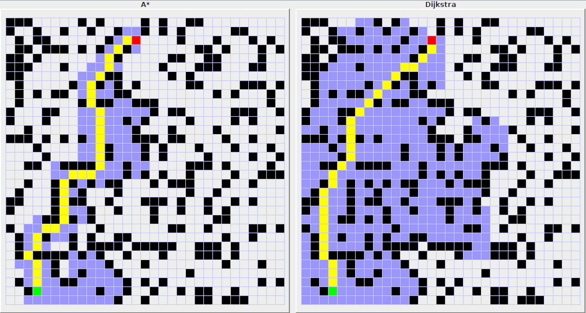
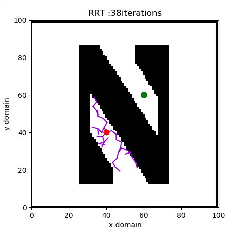
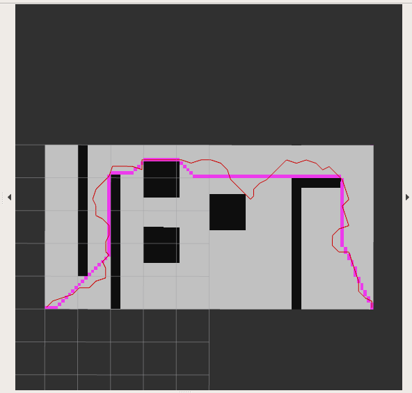
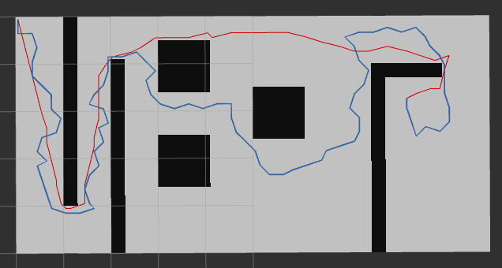
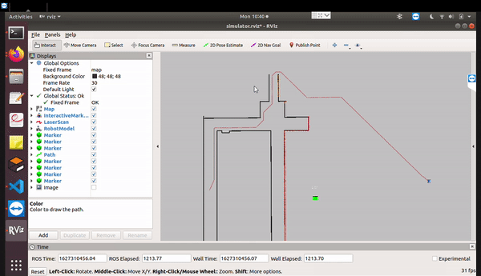
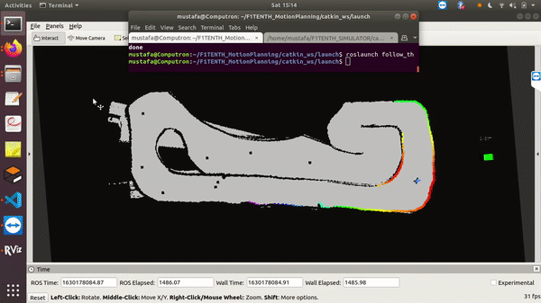

# Motion Planning.

Currently consists the implementation of the following algorithms.   
1. Dijkstra's  
2. A\*  
3. RRT  
4. RRT\*  
5. Pure Pursuit path tracking.  
6. "Follow the gap" reactive control.   

<!-- -->

Each path planning algorithm subscribes to the __/map__ topic for the occupancy grid map, __/gt_pose__ for the car's position and __/move_base_simple/goal__ for the goal position. The calculated path is then published on the appropriately named topic.  

## Dijkstra's algorithm.
Finds a shortest path tree from a single source node, by building a set of nodes that have minimum distance from the source.

The graph has the following:

* vertices, or nodes, denoted in the algorithm by *v* or *u*;
* weighted edges that connect two nodes: *(u,v)* denotes an edge, and *w(u,v)* denotes its weight. 

This is done by initializing three values:

* _dist_, an array of distances from the source node *s* to each node in the graph, initialized the following way: *dist**(s)* = 0; and for all other nodes *v*, *dist(v)* = infinity. This is done at the beginning because as the algorithm proceeds, the *dist* from the source to each node *v* in the graph will be recalculated and finalized when the shortest distance to *v* is found
* *Q*, a min priority queue of all nodes in the graph. The priority queue is evaluated based on the *dist* values of the nodes. At the end of the algorithm's progress, *Q* will be empty.
* *S*, an empty set, to indicate which nodes the algorithm has visited.

The algorithm proceeds as follows:

* While *Q* is not empty, pop the node *v*, that is not already in *S*, from *Q* with the smallest *dist(v)*. In the first run, source node *s* will be chosen because *dist(s)* was initialized to 0. In the next run, the next node with the smallest *dist* value is chosen.
* Add node *v* to *S*, to indicate that *v* has been visited
Update *dist* values of adjacent nodes of the current node *v* as follows: for each new adjacent node *u*,

if *dist*(*v*) + *weight(u,v)* < *dist(u)*, there is a new minimal distance found for *u*, so update *dist(u)* to the new minimal distance value;
otherwise, no updates are made to *dist(u)*.

The algorithm terminates when the goal node has been visited in the graph and the smallest distance from *s* to the goal node has been found. *dist* now contains the shortest path tree from source *s* to all other visited nodes.

The animation below illustrates the working of the algorithm.  

Credit: Wikipedia

## A\* algorithm.
The implementation of the A\* algorithm is almost identical to the Dijkstra's algorithm. The only difference is that the metric for judging nodes is not solely based on the node's *dist* value, but the sum of *dist* and a heuristic *h*. The heuristic *h* of a node is an estiamte of the cost of reaching the goal from that node.  
Let the quantity *f* = *dist* + *h*, then the priority in A\* will be evaluated on the basis of *f* instead of *dist* like in dijkstra. This way the next node to be searched (popped from the priority queue) will be the one with lowest *f*. This translates to the "Best first search" approach since the node with the lowest *f* is __likely__ to be the best. This reduces the number of nodes to be searched to find the path to the goal as nodes that are __less likely__ to be on the shortest path are searched less often.    
The difference between the number of nodes searched by A\* and dijkstra can be seen in the following image where the blue cells are the ones searched and the yellow ones are the final path.    

Credit: Kevin Wang

## RRT algorithms.
The dijkstra's and A\* algorithm are search based algorithms, where the shortest path to the goal is searched from the existing nodes. RRT and RRT\* are sampling based algorithms that do not use an existing graph of the map but create a tree structure by sampling from the continuous configuration space.

### RRT
* An RRT grows a tree rooted at the starting point by using random samples from the search space. As each sample is drawn, a connection is attempted between it and the nearest state in the tree. 
* If the connection is feasible (passes entirely through free space and obeys any constraints), this results in the addition of the new state to the tree. 
* With uniform sampling of the search space, the probability of expanding an existing state is proportional to the size of its Voronoi region. As the largest Voronoi regions belong to the states on the frontier of the search, this means that the tree preferentially expands towards large unsearched areas.
* The length of the connection between the tree and a new state is frequently limited by a growth factor. If the random sample is further from its nearest state in the tree than this limit allows, a new state at the maximum distance from the tree along the line to the random sample is used instead of the random sample itself. The random samples can then be viewed as controlling the direction of the tree growth while the growth factor determines its rate. This maintains the space-filling bias of the RRT while limiting the size of the incremental growth. 

Credit: Maurice Rahme

### RRT\*

RRT\* is an optimized version of RRT. When the number of nodes approaches infinity, the RRT\* algorithm will deliver the shortest possible path to the goal. While realistically unfeasible, this statement suggests that the algorithm does work to develop a shortest path. The basic principle of RRT\* is the same as RRT, but two key additions to the algorithm result in significantly different results.

* First, RRT\* records the distance each vertex has traveled relative to its parent vertex. This is referred to as the cos() of the vertex. There is no such cost matric for the nodes in RRT. After the closest node to a new randomly selected node is found in the graph, a neighborhood of vertices in a fixed radius from the new node are examined. If a node with a cheaper cost() than the closest node is found, the cheaper node replaces the closest node as the parent of the new node. The effect of this feature can be seen with the addition of fan shaped twigs in the tree structure. The cubic structure of RRT is eliminated.
* The second difference RRT\* adds is the rewiring of the tree. After a vertex has been connected to the **cheapest** neighbor, the neighbors are again examined. Neighbors are checked if being rewired to the newly added vertex will make their cost decrease. If the cost does indeed decrease, the neighbor is rewired to the newly added vertex. This feature makes the path more smooth.

Credit: Python Robotics (AtsushiSakai)

<!--## RRT Vs A* algorithm. 

A* V/s RRT

-->

## RRT Vs RRT*                          

RRT: Blue RRT*: Red

<!--## RRT Vs A\*, RRT V/s RRT\*.

   
  

-->

<!--## Pure Pursuit path tracking with path planned by A*.

## Follow the gap algorithm.

-->

## 1) Pure Pursuit. 2) Follow the gap.

   
  

