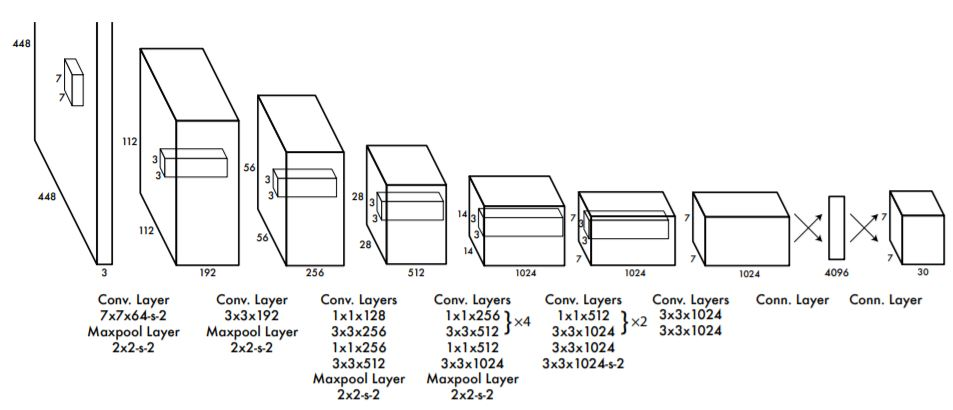

# Perception

Currently consists the implementation of the following algorithms.

--> YOLOv1  

## Introduction

YOLO, stands for You Only Look Once, is an algorithm where objects are detected in a single forward pass, hence it is a single stage detector. YOLO basically splits up an image into different cells and each of the cell outputs a set amount of bounding boxes. Those bounding boxes are responsible for detecting the objects present in a particular cell. Each bounding box in a cell consists of few elements. They are probability that an object exists in that box, coordinates and dimensions of the bounding box (like midpoint, width and height or two corners of the bounding box).  

## Architecture

The network architecture is inspired by the GoogLeNet model for image classification. Our network has 24 convolutional layers followed by 2 fully connected layers. Instead of the inception modules used by GoogLeNet, we simply use 1 × 1 reduction layers followed by 3 × 3 convolutional layers. The architecture is shown below.

